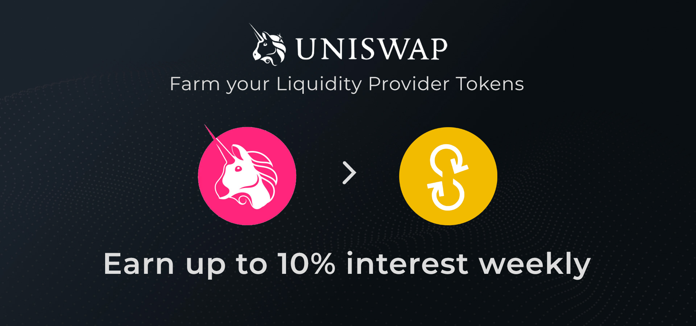

# Liquidity Farming Pool 🔄


This section will present all liquidity farming pools available for ecosystem contributors. Currently there is no liquidity farming pool availale \(the Pool B - Uniswap Liquidity Farming Pool will be launched soon\).


## Pool B - Uniswap Liquidity Farming Pool

The Pool B is a community-developed liquidity farming pool for liquidity providers on Uniswap. All Liquidity providers \(LPs\) on Uniswap will be able to farm their LP tokens \(Uniswap Pool Tokens\) and **earn up to 10% interest WEEKLY \(APW\)** until all YFD tokens reserved for Pool B are distributed.

### How will you start farming with YFD?

#### _Earn Uniswap Fee & YFD Tokens as rewards._

* First you need to be a liquidity provider of [Pool \#1 - Uniswap Liquidity Pool](liquidity-pools.md#liquidity-pool-1-uniswap-weth-yfd) \(see video tutorial on [How-To](../) section\).
* After depositing your \(WETH/YFD\) on Pool \#1 - Uniswap Liquidity Pool, you will receive LP tokens that you can redeem on Uniswap to get back the deposited investment.
* After you’ve successfully farmed your LP tokens in the Pool B, you’ll **earn up to 10% interest weekly \(APW\) in YFD token** until all tokens dedicated to Pool B liquidity farming are distributed.
  * _Note: you’ll be able to stop farming anytime by unfarming your LP tokens on_ [_https://farm.yfdfi.finance_](http://farm.yfdfi.finance)_._

### How are the rewards will be distributed?

* Rewards will be distributed on a daily basis \(earn up to 1.42% interest for each day of liquidity farming completed\);
* The reward model can allow you to **earn up to 10% interest** for each week of liquidity farming completed;
* A Liquidity Provider on Uniswap can farm and unfarm at any time, but they are only rewarded for the 24-hour periods that have been fully completed.
  * For example, if you start farming at 10 am \(timestamp\), you will receive your daily reward every day at 10 am. Then, if you unfarm before 10 am, the current day would not have been fully completed and the reward would not be granted. So, be sure to unfarm shortly after the reward time corresponding to the time you initially start farming.
* Liquidity farming rewards will last as long as there are tokens available \(i.e. 5K YFD initially dedicated for Pool B\)

