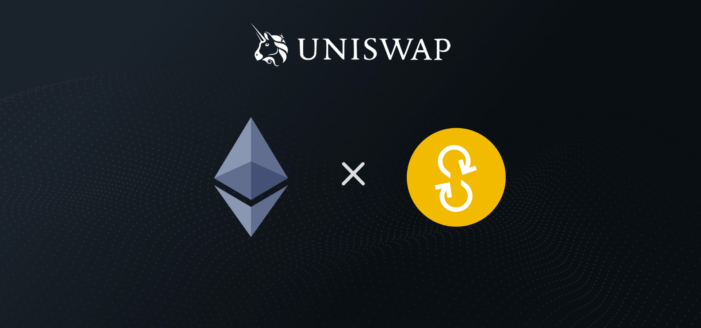

# Liquidity Pools ✅


This section will present all liquidity pools available for YFD token. Currently there is only one liquidity pool available \(other will be launched soon\).


## Liquidity Pool \#1 - Uniswap \(WETH/YFD\)

* Tokens Weight: 50% WETH / 50% YFD
* Initial YFD supply available in the pool: 6,500 YFD
* Liquidity Providers rewards:
  * Portion of transaction fee \(0.3% on Uniswap\)
  * [Pool B - Uniswap Liquidity Farming pool](liquidity-farming-pool.md#pool-b-uniswap-liquidity-farming-pool) \(coming soon\)
* Adding liquidity: [https://app.uniswap.org/\#/add/0xC02aaA39b223FE8D0A0e5C4F27eAD9083C756Cc2/0x4F4F0Ef7978737ce928BFF395529161b44e27ad9](https://app.uniswap.org/#/add/0xC02aaA39b223FE8D0A0e5C4F27eAD9083C756Cc2/0x4F4F0Ef7978737ce928BFF395529161b44e27ad9)
* Buy YFD: [https://app.uniswap.org/\#/swap?inputCurrency=ETH&outputCurrency=0x4f4f0ef7978737ce928bff395529161b44e27ad9](https://app.uniswap.org/#/swap?inputCurrency=ETH&outputCurrency=0x4f4f0ef7978737ce928bff395529161b44e27ad9)

