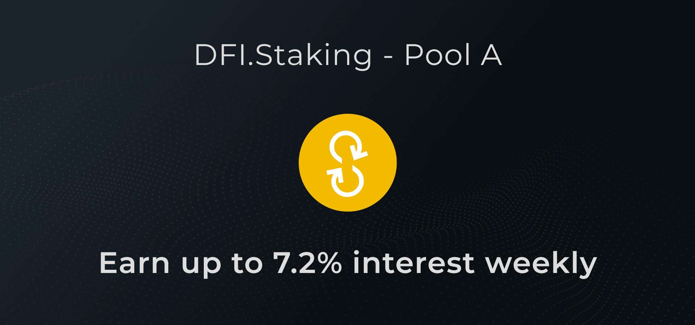

# Staking Pools ✅


This section will present all staking pools available for ecosystem contributors. Currently there is only one staking pool available.


## Pool A - YFD Token Staking Pool \(Now Closed\)

The Pool A is a community-developed staking pool for YFD token holders. All YFD token holders can stake their tokens and **earn up to 7.2% interest WEEKLY \(APW\)** until all YFD tokens reserved for Pool A - Staking Pool are distributed.

* **Staking Contract:** 0x28F2E8822B6eb1BBA8f1C8Ab8df970d813b677D4 **Etherscan explorer:** [https://etherscan.io/address/0x28f2e8822b6eb1bba8f1c8ab8df970d813b677d4](https://etherscan.io/address/0x28f2e8822b6eb1bba8f1c8ab8df970d813b677d4) **Contract status:**  Contract Source Code Verified 

### How do you start staking with YFD?

* The easiest way to get YFD is to buy directly on [Uniswap](https://app.uniswap.org/#/swap?inputCurrency=ETH&outputCurrency=0x4f4f0ef7978737ce928bff395529161b44e27ad9) or on [DFI.Exchange](https://dfi.exchange) — a decentralized trading platform or so called DEX launched by YfDFI Finance contributors.
* Then, connecting a "Metamask" wallet holding your YFD tokens on https://yfd.io to stake your tokens \(see video tutorial on [How-To](../) section\).
* After you’ve successfully staked your YFD tokens in Pool A, you’ll **earn up to 7.2% interest weekly \(APW\) in YFD token** until all tokens dedicated to staking are distributed.

### How are the rewards distributed?

* Rewards are distributed on a daily basis \(earn up to 1% interest for each day of staking completed\);
* The reward model can allow you to **earn up to 7.2% interest** for each week of staking completed;
* A YFD holder can stake and unstake at anytime, but they are only rewarded for the 24-hour periods that have been fully completed.
  * For example, if you stake at 10 am \(timestamp\), you will receive your daily reward every day at 10 am. Then, if you unstake before 10 am, the current day would not have been fully completed and the reward would not be granted. So, be sure to unstake shortly after the reward time corresponding to the time you initially staked.
* Staking rewards will last as long as there are tokens available \(i.e. 6K YFD initially dedicated for Pool A\)

