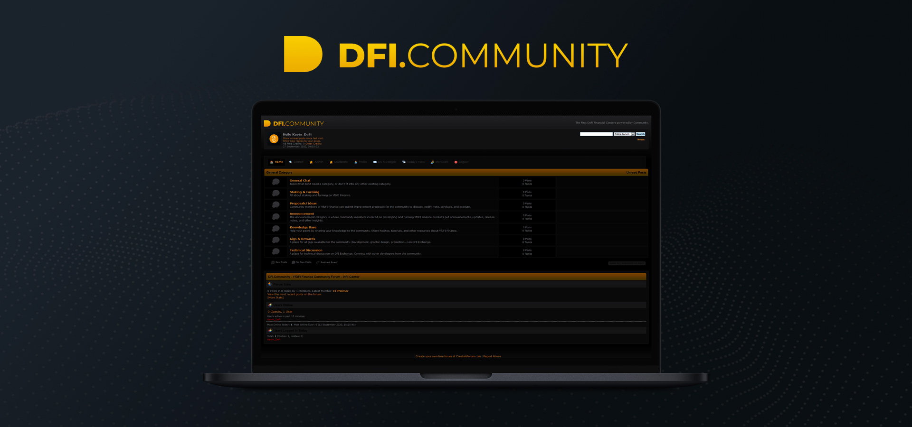

# DFI.Community ✅

DFI.Community is a forum to discuss all subjects regarding YfDFI Finance, from General Chat to Technical Discussion, everyone can make its contribution. All proposals and improvements would be freely discussed within the "Proposals/Idea DFI.Community to gauge the community interest before being officially voted on [DFI.Governance](dfi.governance.md) \(coming soon\).

## Categories

### [General Chat](http://www.dfi.community/general-discussion/)

Topics that don't need a category, or don't fit into any other existing category.

### [Staking & Farming](http://www.dfi.community/farming-staking/)

All about staking and farming on YfDFI Finance.

### [Proposals/Ideas](http://www.dfi.community/proposalsideas/)

Community members of YfDFI Finance can submit improvement proposals for the community to discuss, codify, vote, conclude, and execute.

### [Announcement](http://www.dfi.community/announcement/)

The Announcement category is where community members involved on developing and running YfDFI Finance products put announcements, updates, release notes, and other insights.

### [Knowledge Base](http://www.dfi.community/knowledge-base/)

Help your peers by sharing your knowledge to the community. Share howtos, tutorials, and other resources about YfDFI Finance.

### [Gigs & Rewards](http://www.dfi.community/gigs-rewards/)

A place for all gigs available for the community \(development, graphic design, promotion...\) on YfDFI Finance.

### [Technical Discussion](http://www.dfi.community/technical-discussion/)

A place for technical discussion on YfDFI Finance. Connect with other developers from the community.

