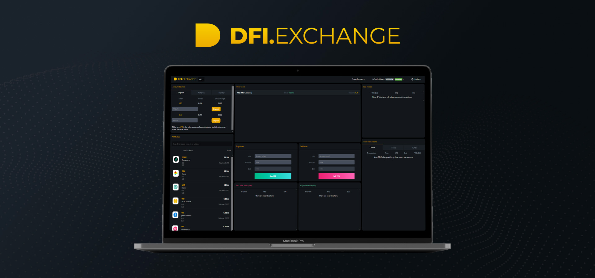
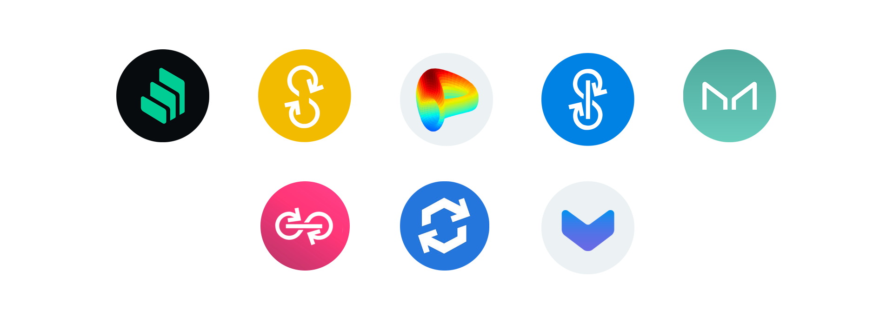

# DFI.Exchange ✅

The idea behind [DFI.Exchange](https://dfi.exchange) is to launch the first decentralized exchange \(DEX\) fully owned and governed by community. A kind of "Binance DEX" dedicated to DeFi and \(above all\) truly decentralized:

* Where the community will choose the tokens listed and delisted through voting hosted on [DFI.Governance](dfi.governance.md) \(coming soon\);
* Where the community \(YFD holders\) will share the income generated by the exchange on a monthly basis \(listing fee, transaction fee\);
* Where the listing costs would be reasonable and paid in project tokens \(this will push the community to list projects they believe in\).


DFI.Exchange \(Beta version\) is already released \([DFI.Exchange](https://dfi.exchange)\). Legitimate tokens within the DeFi space have already been listed for more consistency but all future tokens will be listed through community voting.


From a trader's perspective, DFI.Exchange will allow DeFI enthusiasts to buy/sell their favorite tokens directly with stablecoins \(DAI/TOKEN &gt; TOKEN/DAI\), without having to pass via long routes \(ETH/DAI &gt; DAI/TOKEN &gt; TOKEN/DAI &gt; DAI/ETH\) and consequently pay expensive slippage and transaction fee.

### **🔄 DFI.Exchange v1.0 will include \(under development\):**

* Community voting system for token listing/delisting;
* Automated revenue sharing system \(Smart contract\).

 

