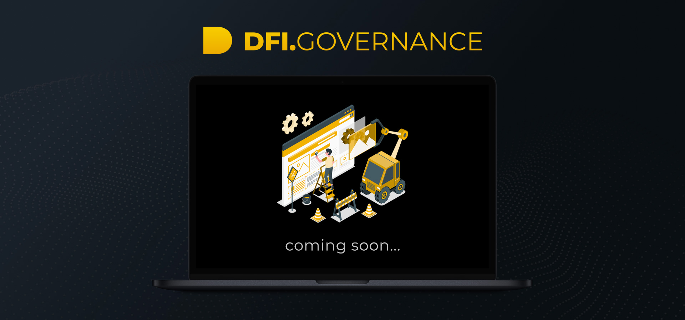

# DFI.Governance 🔄

## YfDFI Finance Governance Model

YfDFI Finance is a community-centered project aiming to build the first DeFi Financial Center fully governed by a worldwide community of DeFi enthusiasts.

The ecosystem is governed by YFD token holders who submit and vote on proposals and who are eligible to receive a share of protocols profits. So, YFD represents a right to govern and a right to receive a portion of ecosystem’s profits. Most of profits generated from each of YfDFI solutions \(DFI.Exchange, DFI.Swap, DFI.Insurance…\) will be redistributed to community.

Anyone can suggest a proposal, firstly within DFI.Community forum to gauge the community interest and secondly at DFI.Governance \(in the near future\). DFI.Governance will be a user-friendly platform to set on-chain community votes related to YfDFI Finance ecosystem.


The voting system will probably be discussed with the community before starting the development, but it will be ready soon to fully automate the decision-making process of YfDFI Finance.


### DFI.Governance \(13/10/2020\)

* **Decision-making process:**

  * All proposals are firstly discussed within DFI.Community Forum. The proposals with more interest are sent to DFI.Governance for a community voting.
  * To vote, YFD holders will need to stake their tokens into the “Governance Contract” which will give them in exchange the equivalent in VOTX token, the fuel token used to vote on DFI.Governance. All VOTX tokens used for a vote will be automatically burned, and all YFD tokens staked into the Governance Contract will be released at the end of the voting process \(2/3 days max.\).
  * At the end of the voting process, the results will be directly available on DFI.Governance platform and then added to the ecosystem progress schedule, also available on DFI.Governance.

* **Profit-Sharing:**
  * As previously explained, most of profits generated from each of YfDFI solutions \(DFI.Exchange, DFI.Swap, DFI.Insurance…\) will be redistributed to community.
  * The idea is to automate the profit-sharing process thanks to monthly snapshots taken to proportionally reward every YFD holders.
  * A Vault will be developed to custody all profits generated every day within the ecosystem. This Vault will temporarily hold profits before distribution to YFD holders.
  * A small portion of profits will be sent to a smaller Vault dedicated to create a reserve for various operating expenses, DFI.Ventures community fund as well as community “Gigs & Rewards”. The percentage to send within this smaller Vault will be decided through a community voting in the near future.

As you’ve understood, we’re trying to build the fairest and more effective on-chain voting system to keep YfDFI Finance as community-centric as possible. Some other improvements are already in the pipes, like a gas free version or a multiple voting rounds version.

Of course, the platform and the overall ecosystem will continue to evolve through community participation to best serve its interest.

